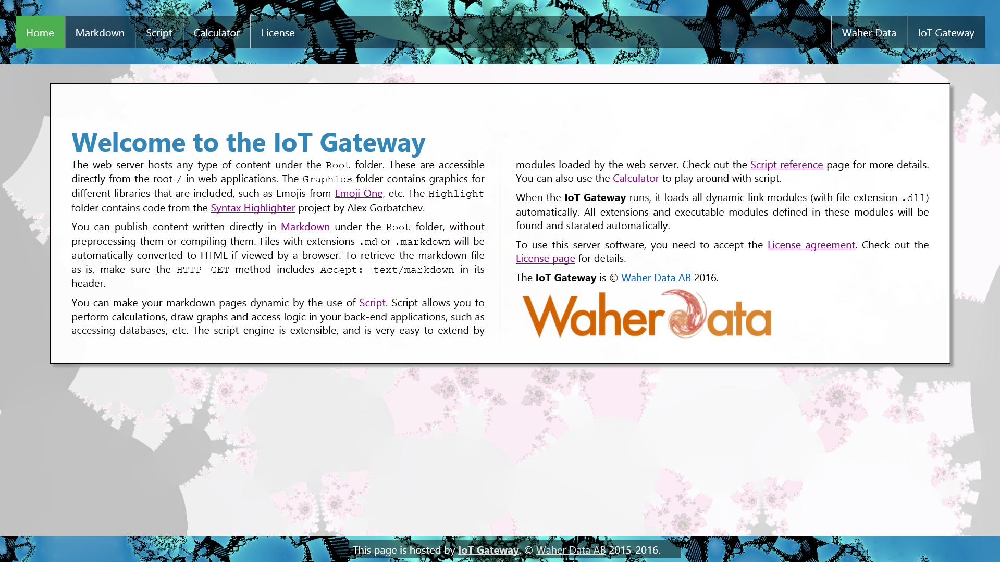
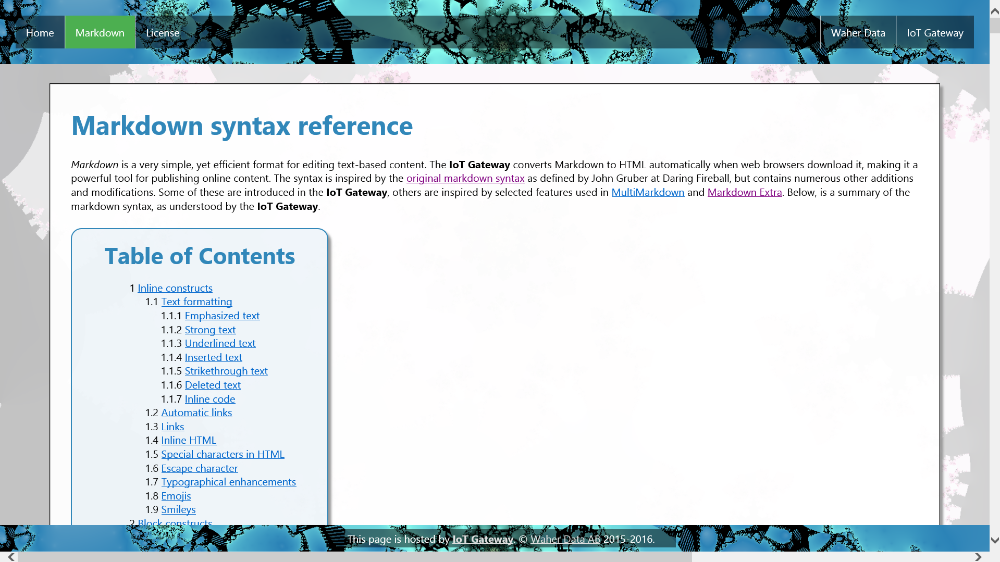
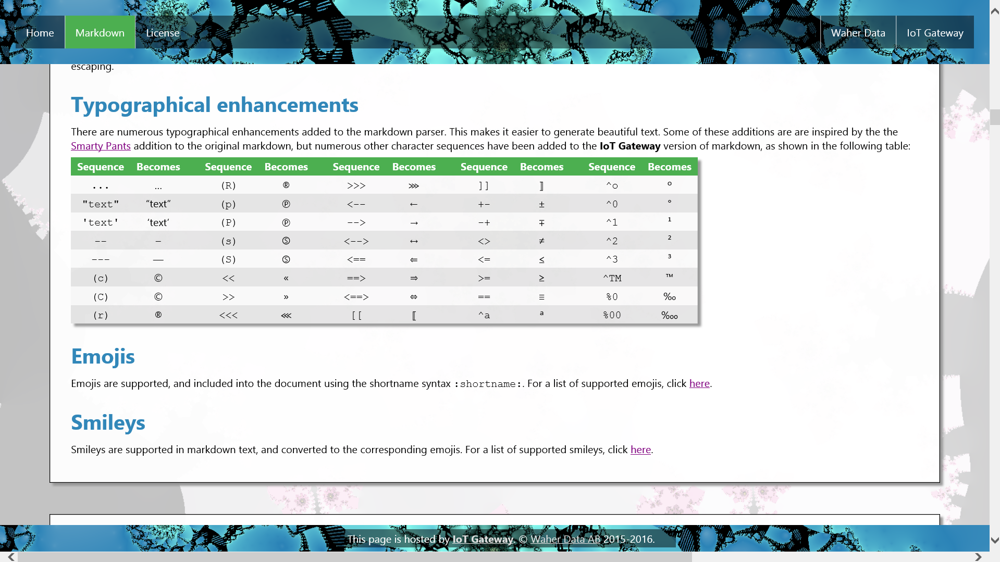
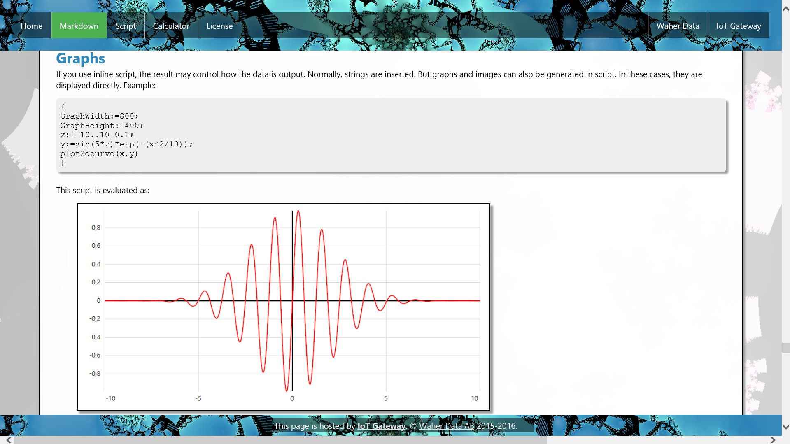
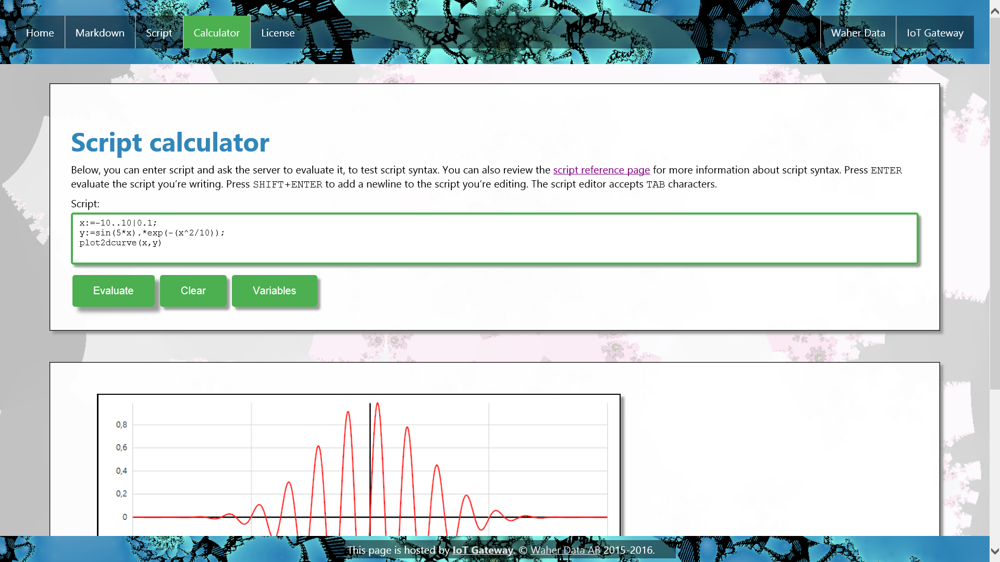

# Waher.IoTGateway.Svc

The **Waher.IoTGateway.Svc** is a Windows service version of the [IoT Gateway](../Waher.IoTGateway). 
It uses XMPP and can be administered using the [Waher.Client.WPF](../Clients/Waher.Client.WPF) application.

The service application requires XMPP credentials to be stored in the `xmpp.config` file. If installed using
the [IoT Gateway installer](../Executables/IoTGatewaySetip.exe), the files will be written to the **Program Data** 
folder `IoT Gateway`, and the `xmpp.config` file will be generated automatically. Otherwise, you can use the
[Waher.IoTGateway.Console](../Waher.IoTGateway.Console) project to create an `xmpp.config` file, or write one manually.

## Web Server

The **IoT Gateway** contains an integrated web server. It can be used to host any web content under the `Root` folder. 
[Markdown](../Content/Waher.Content.Markdown/README.md) content (files with extensions `.md` or `.markdown`) will 
automatically be converted to HTML if viewed by a browser. To retrieve the markdown file as-is, make sure the `HTTP GET` method includes 
`Accept: text/markdown` in its header.

### Using standard HTTP ports

If you want to allow the gateway to have access to the HTTP (80) and HTTPS (443) ports, you need to 
[disable any web server or service running on the machine](http://www.devside.net/wamp-server/opening-up-port-80-for-apache-to-use-on-windows),
or tell them to use different ports. This includes the HTTP Server API, (http.sys), if it is running on the machine, or any other application that 
has these ports open, like Skype. 

If running the application under Linux, you also need administrative privileges when you execute the application, to it to be able to open these ports.

>	On my Windows 8.1 machine, the following, taken from the article above, entred into a command prompt having administrator
>	privileges, and then restarting the machine, shut down the `http.sys` service.
>
>		net stop http /y
>		sc config http start= disabled
>
>	I also had to manually configure Skype to not use HTTP and HTTPS ports for incoming calls.

**Note**: If using the [IoT Gateway installer](../Executables/IoTGatewaySetip.exe) to install the application, the
above is done as part of the installation. 

## Pluggable modules.

The IoT Gateway supports pluggable modules. All modules found in the binary folder of the gateway are loaded at startup. Each class 
implementing the `Waher.Script.IModule` interface will be informed correspondingly when the server is started and stopped. The
`Waher.Script.Types` class contains static methods for accessing *module parameters*. These are used to pass information from the server
to each module. There are different module parameters defined by the IoT Gateway:

| Name   | Description |
|--------|-------------|
| `AppData` | Where the **IoT Gateway** application data folder is situated. |
| `HTTP` | `HttpServer` object hosting the web server. |
| `HTTPX` | `HttpxProxy` object providing `httpx` support to web clients. |
| `Root` | Where the **IoT Gateway** web folder is situated. All content in this folder, including subfolders, is accessible through the web interface. |
| `XMPP` | `XmppClient` object managing the XMPP connection of the gateway. |

## Object database

The IoT Gateway hosts an object database based on [MongoDB](https://www.mongodb.com/download-center), via interfaces provided by the
`Waher.Persistence` library. The interface to the [MongoDB](https://www.mongodb.com/download-center) database is not published to modules 
in any way, forcing them to go through `Waher.Persistence`. This makes it easy to port the gateway to other object database providers,
without having to update code in all pluggable modules.

**Note**: If using the [IoT Gateway installer](../Executables/IoTGatewaySetip.exe) to install the application, 
MongoDB is automatically installed on the machine, if not already installed.

## Installer

You can also install the service using the [IoT Gateway installer](../Executables/IoTGatewaySetup.exe).

## License

You should carefully read the following terms and conditions before using this software. Your use of this software indicates
your acceptance of this license agreement and warranty. If you do not agree with the terms of this license, or if the terms of this
license contradict with your local laws, you must remove any files from the **IoT Gateway** from your storage devices and cease to use it. 
The terms of this license are subjects of changes in future versions of the **IoT Gateway**.

You may not use, copy, emulate, clone, rent, lease, sell, modify, decompile, disassemble, otherwise reverse engineer, or transfer the
licensed program, or any subset of the licensed program, except as provided for in this agreement.  Any such unauthorised use shall
result in immediate and automatic termination of this license and may result in criminal and/or civil prosecution.

The [source code](https://github.com/PeterWaher/IoTGateway) provided in this project is provided open for the following uses:

* For **Personal evaluation**. Personal evaluation means evaluating the code, its libraries and underlying technologies, including learning 
	about underlying technologies.

* For **Academic use**. If you want to use the following code for academic use, all you need to do is to inform the author of who you are, what 
	academic institution you work for (or study for), and in what projects you intend to use the code. All I ask in return is for an 
	acknowledgement and visible attribution to this project, inluding a link, and that you do not redistribute the source code, or parts thereof 
	in the solutions you develop. If any solutions developed in an academic setting, become commercial, it will need a commercial license.

* For **Security analysis**. If you perform any security analysis on the code, to see what security aspects the code might have,
	all I ask is that you inform me of any findings so that any vulnerabilities might be addressed. I am thankful for any such contributions,
	and will acknowledge them.

All rights to the source code are reserved and exclusively owned by [Waher Data AB](http://waher.se/). If you're interested in using the 
source code, as a whole, or partially, you need a license agreement with the author. You can contact him through [LinkedIn](http://waher.se/).

This software is provided by the copyright holder and contributors "as is" and any express or implied warranties, including, but not limited to, 
the implied warranties of merchantability and fitness for a particular purpose are disclaimed. In no event shall the copyright owner or contributors 
be liable for any direct, indirect, incidental, special, exemplary, or consequential damages (including, but not limited to, procurement of substitute 
goods or services; loss of use, data, or profits; or business interruption) however caused and on any theory of liability, whether in contract, strict 
liability, or tort (including negligence or otherwise) arising in any way out of the use of this software, even if advised of the possibility of such 
damage.

The **IoT Gateway** is &copy; [Waher Data AB](http://waher.se/) 2016.
 

