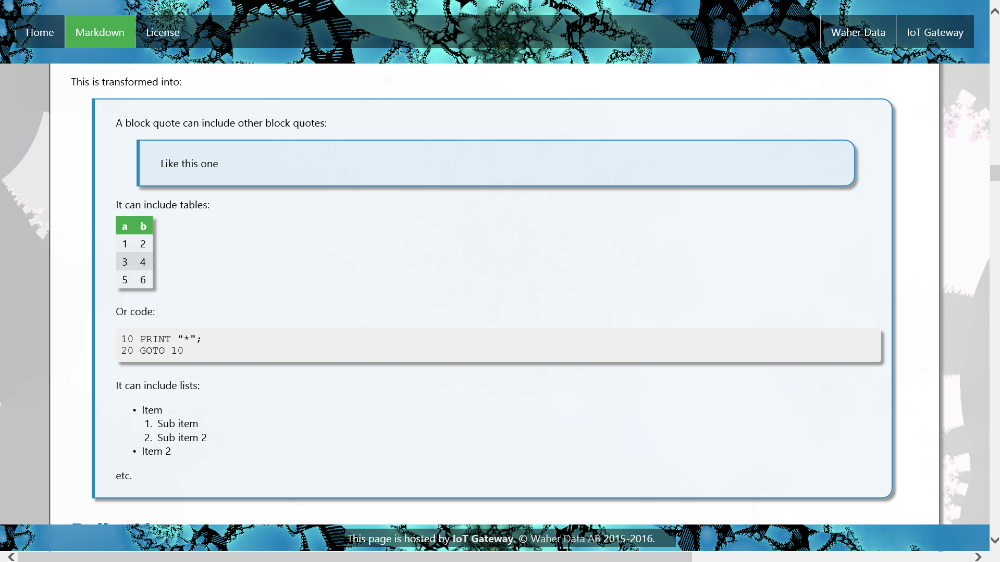
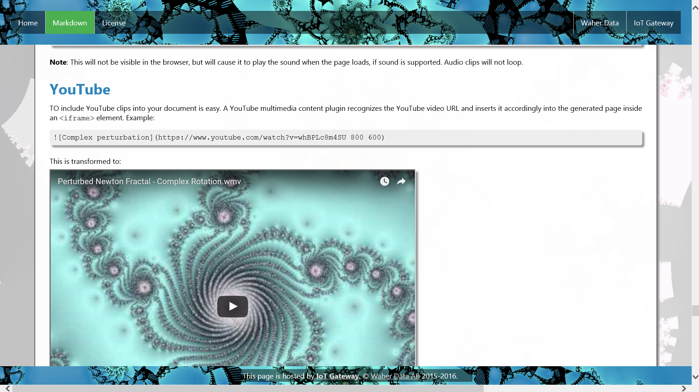
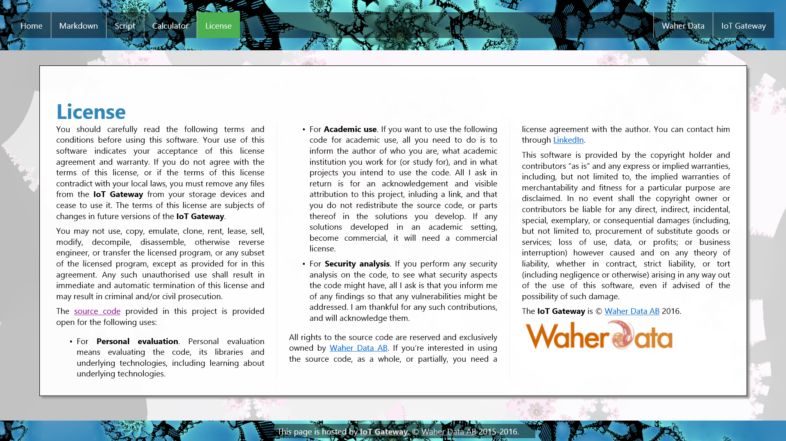
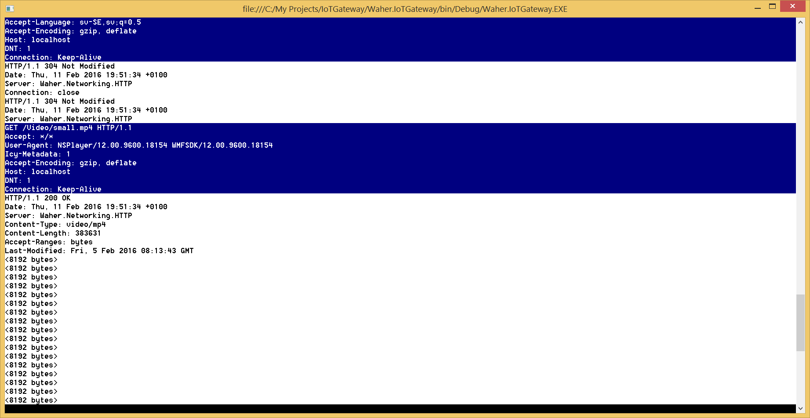

# Waher.IoTGateway

The **Waher.IoTGateway** is a console application version of the IoT gateway. It's easy to use and experiment with. It uses XMPP and can be administered 
using the [Waher.Client.WPF](../Clients/Waher.Client.WPF) application.

The first time the application is run, it provides a simple console interface for the user to provide network credentials. 
These credentials are then stored in the **xmpp.config** file. Passwords are hashed. 

## Web Server

The **IoT Gateway** contains an integrated web server. It can be used to host any web content under the `Root` folder. 
[Markdown](../Content/Waher.Content.Markdown/README.md) content (files with extensions `.md` or `.markdown`) will 
automatically be converted to HTML if viewed by a browser. To retrieve the markdown file as-is, make sure the `HTTP GET` method includes 
`Accept: text/markdown` in its header.

### Using standard HTTP ports

If you want to allow the gateway to have access to the HTTP (80) and HTTPS (443) ports, you need to 
[disable any web server or service running on the machine](http://www.devside.net/wamp-server/opening-up-port-80-for-apache-to-use-on-windows),
or tell them to use different ports. This includes the HTTP Server API, (http.sys), if it is running on the machine, or any other application that 
has these ports open, like Skype. 

If running the application under Linux, you also need administrative privileges when you execute the application, to it to be able to open these ports.

>	On my Windows 8.1 machine, the following, taken from the article above, entred into a command prompt having administrator
>	privileges, and then restarting the machine, shut down the `http.sys` service.
>
>		net stop http /y
>		sc config http start= disabled
>
>	I also had to manually configure Skype to not use HTTP and HTTPS ports for incoming calls.

## Console interface

It also outputs any events and network communication to the console, to facilitate implementation of IoT interfaces. 

## License

The source code provided in this project is provided open for the following uses:

* For **Personal evaluation**. Personal evaluation means evaluating the code, its libraries and underlying technologies, including learning 
	about underlying technologies.

* For **Academic use**. If you want to use the following code for academic use, all you need to do is to inform the author of who you are, what academic
	institution you work for (or study for), and in what projects you intend to use the code. All I ask in return is for an acknowledgement and
	visible attribution to this project.

* For **Security analysis**. If you perform any security analysis on the code, to see what security aspects the code might have,
	all I ask is that you inform me of any findings so that any vulnerabilities might be addressed. I am thankful for any such contributions,
	and will acknowledge them.

All rights to the source code are reserved. If you're interested in using the source code, as a whole, or partially, you need a license agreement
with the author. You can contact him through [LinkedIn](http://waher.se/).

This software is provided by the copyright holders and contributors "as is" and any express or implied warranties, including, but not limited to, 
the implied warranties of merchantability and fitness for a particular purpose are disclaimed. In no event shall the copyright owner or contributors 
be liable for any direct, indirect, incidental, special, exemplary, or consequential damages (including, but not limited to, procurement of substitute 
goods or services; loss of use, data, or profits; or business interruption) however caused and on any theory of liability, whether in contract, strict 
liability, or tort (including negligence or otherwise) arising in any way out of the use of this software, even if advised of the possibility of such 
damage.
